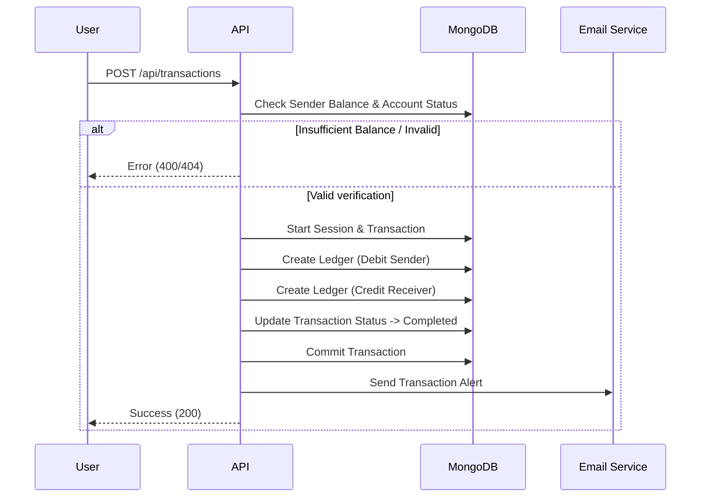

# BankTransactions Backend

A robust backend application for a banking system, built with Node.js, Express, and MongoDB. This system handles secure user authentication, account creation, and money transfers with transactional integrity.

## 🚀 Features

-   **User Authentication**: Secure Register and Login with JWT and Cookies.
-   **Account Management**: valid user can create an account and check balance.
-   **Secure Transactions**: Money transfers between accounts using **MongoDB Transactions** (ACID properties) to ensure data consistency.
-   **Idempotency**: Prevents duplicate transactions using `idempotencyKey`.
-   **Email Notifications**: Integration with Gmail to send alerts for registration and transactions.
-   **System Funds**: endpoint to inject initial funds into accounts.

## 🛠️ Tech Stack

-   **Runtime**: Node.js
-   **Framework**: Express.js
-   **Database**: MongoDB (Mongoose)
-   **Authentication**: JSON Web Tokens (JWT)

## 🏗️ Architecture & Flows

### Transaction Flow
The system ensures that money is safely transferred by using a database session. If any step fails (e.g., insufficient funds, database error), the entire operation is rolled back.



## 🔌 API Endpoints

### 1. Authentication
Base URL: `/api/auth`

| Method | Endpoint    | Description             | Body Parameters |
| :----- | :---------- | :---------------------- | :-------------- |
| POST   | `/register` | Register a new user     | `name`, `email`, `password` |
| POST   | `/login`    | Login user & get cookie | `email`, `password` |

### 2. Accounts
Base URL: `/api/accounts` (Protected Routes)

| Method | Endpoint               | Description                      | Body Parameters |
| :----- | :--------------------- | :------------------------------- | :-------------- |
| POST   | `/`                    | Create a new bank account        | _None_ (Uses logged-in user) |
| GET    | `/`                    | Get my account details           | _None_ |
| GET    | `/balance/:accountid`  | Get balance by Account ID        | _None_ |

### 3. Transactions
Base URL: `/api/transactions` (Protected Routes)

| Method | Endpoint                | Description                            | Body Parameters |
| :----- | :---------------------- | :------------------------------------- | :-------------- |
| POST   | `/`                     | Transfer money between accounts        | `fromAccount`, `toAccount`, `amount`, `idempotencyKey` |
| POST   | `/system/initial-funds` | Inject initial funds (System)          | `toAccount` (or userId), `amount`, `idempotencyKey` |

## 📦 Request Body Examples

**Register User**
```json
{
  "name": "Jane Doe",
  "email": "jane@example.com",
  "password": "securepassword123"
}
```

**Transfer Money**
```json
{
  "fromAccount": "65d4...",
  "toAccount": "65d5...",
  "amount": 500,
  "idempotencyKey": "unique-key-123"
}
```

## 🚀 How to Run

1.  **Clone the repository:**
    ```bash
    git clone <your-repo-url>
    cd BankTransactions
    ```

2.  **Install dependencies:**
    ```bash
    npm install
    ```

3.  **Setup Environment Variables:**
    Create a `.env` file in the root directory and add:
    ```env
    PORT=3000
    MONGO_URI=your_mongodb_connection_string
    JWT_SECRET=your_jwt_secret
    GMAIL_USER=your_email@gmail.com
    GMAIL_PASS=your_app_password
    ```

4.  **Start the server:**
    ```bash
    npm run dev
    # or
    npm start
    ```
